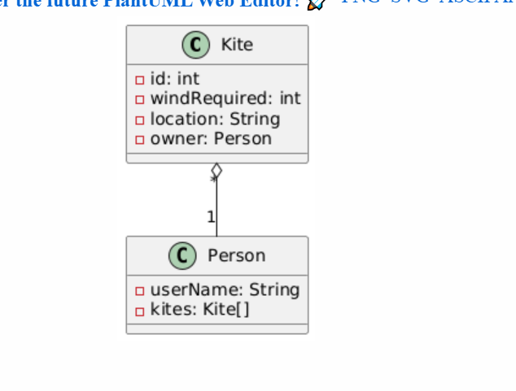

# Kite manager con microservicios

## Mi tablero de Trello

https://trello.com/b/D2C2W1lb/kite-manager-microservices

## Links al resto de repositorios

* discovery-server -> https://github.com/Kite-manager-final-project/discovery-server.git

* kite-service -> https://github.com/Kite-manager-final-project/kite-service.git

* person-service -> https://github.com/Kite-manager-final-project/person-sevice.git

## Diagrama UML

Este diagrama nos da una idea de la estructura del proyecto

```
@startuml
class Kite{
- id: int
- windRequired: int
- location: String
- owner: Person
}


class Person {
- nickName: String
- name: String
- phoneNumber: int
- email: string
}


Kite "*" o-- "1" Person

@enduml
```




NOTA: Pese a que en el diagrama UML se aprecia que en la clase Kite el owner es una Person, A la hora de desarrollar el proyecto y
al estar separado cada microservicio con su base de datos independiente. En realidad, va a ser una referencia. En el caso de owner, una string que
haga referencia al nombre de la persona.
Para añadir más contenido a la clase person y que no tenga solo el nickname, le he puesto como atributo su nombre completo, número de 
teléfono y dirección de correo.
