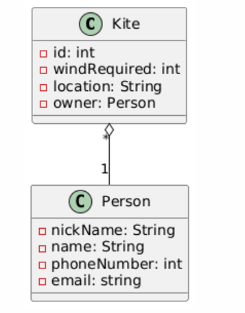
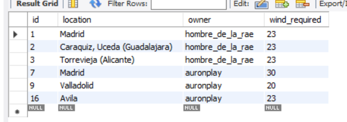

# Kite manager con microservicios

## Mi tablero de Trello

https://trello.com/b/D2C2W1lb/kite-manager-microservices

## Links al resto de repositorios

* discovery-server -> https://github.com/Kite-manager-final-project/discovery-server.git

* kite-service -> https://github.com/Kite-manager-final-project/kite-service.git

* person-service -> https://github.com/Kite-manager-final-project/person-sevice.git

## Diagrama UML

Este diagrama nos da una idea de la estructura del proyecto

```
@startuml
class Kite{
- id: int
- windRequired: int
- location: String
- owner: Person
}


class Person {
- nickName: String
- name: String
- phoneNumber: int
- email: string
}


Kite "*" o-- "1" Person

@enduml
```





NOTA: Pese a que en el diagrama UML se aprecia que en la clase Kite el owner es una Person, A la hora de desarrollar el proyecto y
al estar separado cada microservicio con su base de datos independiente. En realidad, va a ser una referencia. En el caso de owner, una string que
haga referencia al nombre de la persona.
Para añadir más contenido a la clase person y que no tenga solo el nickname, le he puesto como atributo su nombre completo, número de 
teléfono y dirección de correo.

## Tablas en las bases de datos

Al tratarse de un microservicio, las bases de datos están separadas, por lo tanto, no hay relaciones explicitas en las tablas. Tenemos:

* person_micro (tabla persons)


* kite_micro (tabla kites)



Como se aprecia, en la tabla de cometas hay una referencia al dueño, concretamente, la columna owner, sin embargo, no es ninguna clave foránea.
Simplemente, es de tipo ```varchar```.

## Puertos de cada API

Tenemos estás APIs con sus respectivos puertos.

* ```discovery-server``` -> Es la API de todos los microservicios que escucha las peticiones, el número de puerto por el que está escuchando es
                      el ```8761```.

* ```api-kite-gateway``` -> Es la API que hace de intermediario entre los clientes y el servidor, según la ruta que le mande el cliente, 
                            llamará a una api o a otra. Tiene como número de puerto el ```8180```.

* ```person-service``` -> Es la API que gestiona las personas guardadas en la base de datos. Tiene como número de puerto el ```8081```.

* ```kite-service``` -> Es el servidor que gestiona las cometas guardadas en la base de datos. Este, a su vez, realizará llamadas a 
                        person-service donde sea necesario, ya sea, para ver el dueño de cada cometa de forma detallada, o bien, para
                        realizar comprobaciones, como verificar que el dueño asignado a esa cometa exista en la base de datos.
                        Tiene como número de puerto el ```8080```.

En resumen, discovery-server toma el rol de servidor, api-kite-gateway toma el rol de intermediario, y tanto kite-service como person-service
toman el rol de clientes.