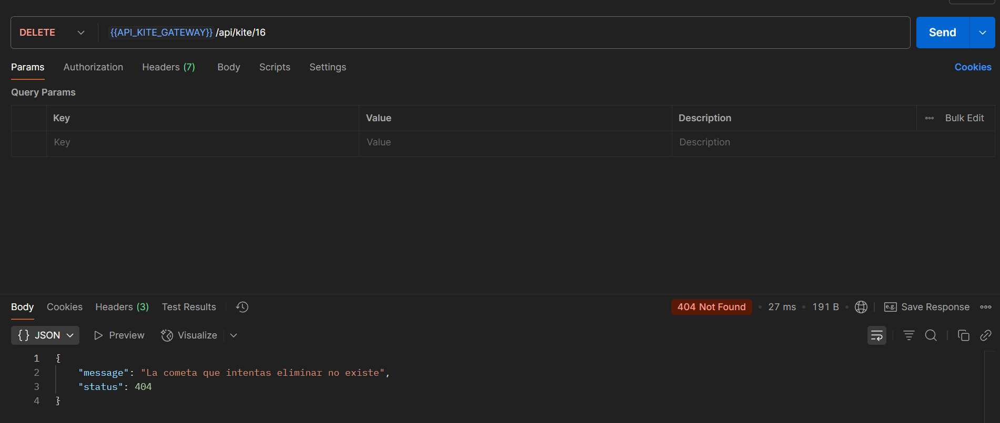

# Kite manager con microservicios

## Presentación Canva

[https://www.canva.cmvn clean packageom/design/DAGnVvLkai8/cfejTn0jg6HY0nOd8G5iuQ/edit](https://www.canva.com/design/DAGnVvLkai8/cfejTn0jg6HY0nOd8G5iuQ/edit)

## Mi tablero de Trello

https://trello.com/b/D2C2W1lb/kite-manager-microservices

## Links al resto de repositorios

* discovery-server -> https://github.com/Kite-manager-final-project/discovery-server.git

* kite-service -> https://github.com/Kite-manager-final-project/kite-service.git

* person-service -> https://github.com/Kite-manager-final-project/person-sevice.git

## Diagrama UML

Este diagrama nos da una idea de la estructura del proyecto

```
@startuml
class Kite{
- id: int
- windRequired: int
- location: String
- owner: Person
}


class Person {
- nickName: String
- name: String
- phoneNumber: int
- email: string
}


Kite "*" o-- "1" Person

@enduml
```


NOTA: Pese a que en el diagrama UML se aprecia que en la clase Kite el owner es una Person, A la hora de desarrollar el proyecto y
al estar separado cada microservicio con su base de datos independiente. En realidad, va a ser una referencia. En el caso de owner, una string que
haga referencia al nombre de la persona.
Para añadir más contenido a la clase person y que no tenga solo el nickname, le he puesto como atributo su nombre completo, número de 
teléfono y dirección de correo.

## Tablas en las bases de datos

Al tratarse de un microservicio, las bases de datos están separadas, por lo tanto, no hay relaciones explicitas en las tablas. Tenemos:

* person_micro (tabla persons)


* kite_micro (tabla kites)


Como se aprecia, en la tabla de cometas hay una referencia al dueño, concretamente, la columna owner, sin embargo, no es ninguna clave foránea.
Simplemente, es de tipo ```varchar```.

## Puertos de cada API

Tenemos estás APIs con sus respectivos puertos.

* ```discovery-server``` -> Es la API de todos los microservicios que escucha las peticiones, el número de puerto por el que está escuchando es
                      el ```8761```.

* ```api-kite-gateway``` -> Es la API que hace de intermediario entre los clientes y el servidor, según la ruta que le mande el cliente, 
                            llamará a una api o a otra. Tiene como número de puerto el ```8180```.

* ```person-service``` -> Es la API que gestiona las personas guardadas en la base de datos. Tiene como número de puerto el ```8081```.

* ```kite-service``` -> Es el servidor que gestiona las cometas guardadas en la base de datos. Este, a su vez, realizará llamadas a 
                        person-service donde sea necesario, ya sea, para ver el dueño de cada cometa de forma detallada, o bien, para
                        realizar comprobaciones, como verificar que el dueño asignado a esa cometa exista en la base de datos.
                        Tiene como número de puerto el ```8080```.

En resumen, discovery-server toma el rol de servidor, api-kite-gateway toma el rol de intermediario, y tanto kite-service como person-service
toman el rol de clientes.

## DEMOs

A continuación, las siguientes capturas de pantalla es de como se comporta la aplicación en sí. Voy a mostrar algunos ejemplos.

### Request persons

En cada petición, donde es necesario realizar validaciones. En caso de que algo falle, en postman aparecerá el mensaje de error para que
el usuario sepa lo que esta succediendo.

Los posibles fallos son que la persona no existe (HTTP_STATUS.NOT_FOUND (404)) o que intento crear una persona con un nickname ya existente
(HTTP_STATUS.CONFLICT (409))

#### Busqueda de todas las personas (GET)


#### Búsqueda de una persona por nickName (GET)

Por ejemplo, aquí voy a buscar una persona que no existe, para mostrar un mensaje de error. En caso contrario, mostraría la persona con todos
los campos.


#### Crear una nueva persona (POST)

Aquí voy a crear una nueva persona, si le especifico un nickName que ya existe, devuelve un HTTP_STATUS.CONFLICT (409) junto con el mensaje de
error.


Para que me cree esa persona, voy a asignarle como nickName debugger

#### Modificar una persona (PUT)

Aquí hay que especificar todos los campos, salvo el nickName. Si le paso un nickName no existente, devuelve un HTTP_STATUS.NOT_FOUND (404)
El nickName es el parámetro que le paso en la ruta (Path Variable)

#### Modificar correo electrónico (PATCH)

Dado el nickName, le paso la nueva dirección de correo para modificarla, falla si le mando un nickName no existente.


#### Modificar el número de teléfono (PATCH)

Dado el nickName, le paso el número de teléfono para modificarlo, falla si le mando un nickName no existente.


#### Eliminar a una persona (DELETE)

Dado el nickname, si existe esa persona, la elimina y devuelve un mensaje de confirmación. En caso contrario, devuelve un mensaje de error.


### Request kites

Aquí, voy a poner algunas demos de los endpoints que hace llamadas a la API de cometas mediante el gateway

#### Búsqueda de varias cometas (GET)

En este ejemplo, muestro todas las cometas. Si se desea filtrar, o bien, por ubicación, o bien, por dueño, o bien, por ambas.
Saldrían las cometas que cumplan ese filtro. Además de las cometas en sí, me sale también la persona propietaria con todos los campos

Por ejemplo, busco las cometas que tenga hombre_de_la_rae


Ahora busco las cometas que se estén usando en Madrid


Busco todas las cometas que se estén usando en Madrid y sean de hombre_de_la_rae


#### Búsqueda de cometa por ID (GET)

En este caso, busco una cometa en particular por ID, si lo encuentra, me sale la cometa en sí y su propietario. En caso contrario,
sale un mensaje de error de que no existe.

En este ejemplo, le paso un ID que no existe


#### Nueva cometa (POST)

Aquí creo una nueva cometa, y me aseguro que el owner existe en la base de datos de personas, ya que si le paso un nickname que no existe, no
la va a crear.

Pruebo a pasarle un nickName que no existe


Voy a hacer a misma petición, pero pasándole como ownwer auronplay para que me la cree correctamente.


#### Modificar cometa (PUT)

Aquí permite modificar varios campos de la cometa, garantizo que el owner no se pueda cambiar. Partiendo de esta tabla


Voy a intentar modificar la 17 cambiándole el owner


Para que me lo actualice correctamente, voy a pasarle como owner auronplay.


#### Modificar el viento requerido de una cometa (PATCH)

Dado el id, le modifico el viento requerido a una cometa, si no encuentra ese ID, devuelve NOT_FOUND y el mensaje de error correspondiente.


#### Modificar la ubicación (PATCH)

Dado el id, le modifico la ubicación a una cometa, si no encuentra ese ID, devuelve NOT_FOUND y el mensaje de error correspondiente.


#### Eliminar una cometa (DELETE)

Dado el id, elimino la cometa. Si existía, devuelve un mensaje de confirmación de que se ha eliminado correctamente.
En caso contrario, devuelve un mensaje de error indicando de que no existe ninguna cometa con ese ID.


Si vuelvo a mandar la misma petición, me saldrá el mensaje de error porque ya no existe.


